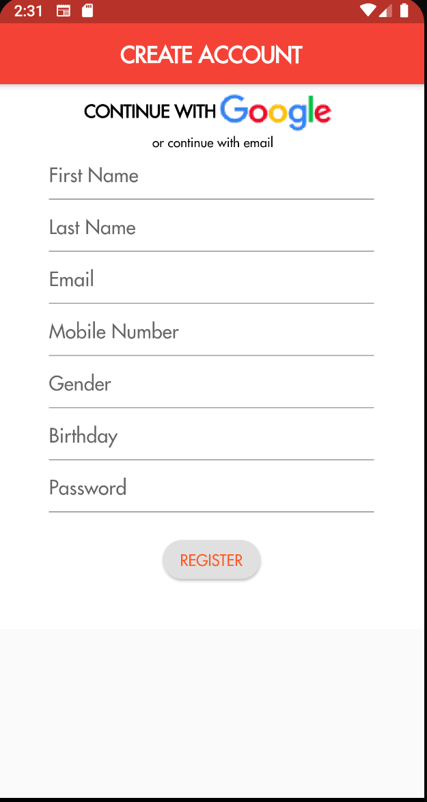

# Dine N Dash

A Flutter application.

## Introduction

We intend to create a seamless and time efficient Point-of-Sale system that will create a better experience for both restaurants and their guest. Dine n’ Dash will be available own both iOS and Android devices. The sole purpose of the application is to allow our users with the capabilities to check into restaurants, view and order from their menu, check live status updates, and checkout via the mobile application. Meanwhile the same will apply for the restaurant's end by allowing the servers to submit and take orders through the application and transfer it over to the kitchen seamlessly. Our goal is to make everyone's life easier by keeping them on the same page, and that’s the reason why we decided to build an application to cater towards improving IOT within the food industry.

User selects whether employee or customer.

User can use google sign in or create an account.

List of tables assigned to user is displayed.User can add a table using + button.

Items can be added to the table using the menu icon.

The scan customer button scans and links a customer's member card to the table. Table is updated accordingly.

Users submit the order to be prepared. Status is reflected on the table.

The waiter can submit to pay the order.

Any added table or updated table will be reflected to the user's list of tables.

A worker can interact with a coworker's list of tables through proxy in the Sandwhich Bar

Cards can be used for payment using Square's api

